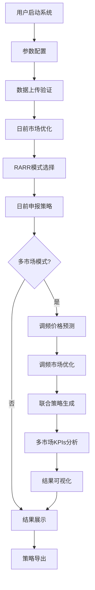

# 液流电池储能电站多市场联合优化决策系统

<div align="center">


**基于数学优化的液流电池储能电站多市场参与决策支持系统**

[功能特性](#功能特性) • [快速开始](#快速开始) • [系统架构](#系统架构) • [使用指南](#使用指南) • [技术文档](#技术文档)

</div>

---

## 📋 项目概述

本系统是一个专为液流电池储能电站设计的多市场联合优化决策支持平台，基于严格的数学建模和先进的优化算法，帮助储能电站制定科学的市场参与策略，实现经济效益最大化。

### 🎯 核心价值

- **📈 收益提升**：通过多市场联合优化，储能电站收益可提升20%以上
- **🧠 智能决策**：基于数学优化的科学决策，避免经验决策的主观性
- **⚡ 实时响应**：支持日前市场和调频辅助服务市场的实时优化
- **🔧 易于使用**：直观的Web界面，无需专业编程知识

### 🏆 技术亮点

- **三阶段优化策略**：日前市场优化 → 调频价格预测 → 调频市场优化
- **RARR智能模式选择**：自动选择最优申报模式（报量不报价/报量报价）
- **机器学习价格预测**：集成多种算法预测调频里程价格
- **液流电池专用建模**：充分考虑液流电池技术特性和约束条件

---

## 🚀 功能特性

### 📊 日前市场优化
- ✅ **经济最大化建模**：构建储能电站日前市场收益最大化数学模型
- ✅ **技术约束完整**：考虑功率、SOC、循环寿命、爬坡率等全面约束
- ✅ **液流电池特性**：专门建模电解液流量、充放电效率等特有参数
- ✅ **智能模式选择**：RARR方法自动选择报量不报价/报量报价模式
- ✅ **申报策略生成**：生成96个15分钟时段的详细申报计划

### ⚡ 调频辅助服务市场优化
- ✅ **价格预测模型**：基于历史数据的调频里程价格预测
- ✅ **收益最大化优化**：考虑容量补偿和里程补偿的综合收益模型
- ✅ **成本精确建模**：退化成本、效率损失、运维成本的详细计算
- ✅ **市场规则遵循**：严格按照广东调频辅助服务市场实施细则建模
- ✅ **多约束优化**：功率兼容性、SOC兼容性、经济性等多重约束

### 🔄 多市场联合优化
- ✅ **协调优化**：日前市场和调频市场的联合决策优化
- ✅ **策略整合**：生成统一的多市场申报策略
- ✅ **收益分析**：详细的收益增量分析和风险评估
- ✅ **KPIs对比**：全面的关键性能指标对比分析

### 🎨 用户界面与可视化
- ✅ **直观配置界面**：分类清晰的参数配置选项卡
- ✅ **数据上传支持**：支持电价预测和调频历史数据上传
- ✅ **实时结果展示**：三层次结果展示（日前→调频→联合）
- ✅ **丰富可视化**：多维度图表分析和趋势展示
- ✅ **策略导出**：支持申报策略表格导出

---

## 🏗️ 系统架构

### 📁 项目结构

```
liquid_flow_battery_multi_market/
├── 📱 app/                                    # 前端应用层
│   └── multi_market_app.py                   # Streamlit主应用
├── 🧮 models/                                 # 数学模型层
│   ├── optimization_model.py                 # 日前市场优化模型
│   ├── parameter_config.py                   # 参数配置管理
│   ├── frequency_price_predictor.py          # 调频价格预测模型
│   ├── frequency_optimization.py             # 调频市场优化模型
│   └── multi_market_coordinator.py           # 多市场协调器
├── 🛠️ utils/                                  # 工具模块层
│   ├── data_processor.py                     # 数据处理工具
│   ├── visualization.py                      # 日前市场可视化
│   ├── frequency_data_processor.py           # 调频数据处理
│   └── multi_market_visualization.py         # 多市场可视化
├── 📊 data/                                   # 数据存储层
│   ├── price_forecast.csv                    # 电价预测数据
│   ├── frequency_demand_history.csv          # 历史调频需求
│   └── frequency_price_history.csv           # 历史调频价格
├── 📋 requirements.txt                        # 依赖包列表
├── 📖 README.md                              # 项目说明文档
└── 📄 多市场优化决策模型技术报告.md           # 技术报告
```

### 🔄 系统工作流程



### 🧮 核心算法

#### 日前市场优化模型
```
目标函数：max Σ[λt·Pdis,t·ηdis·Δt - λt·Pch,t·Δt/ηch] - Ccycle - COM - Cpenalty
决策变量：Pch,t, Pdis,t, Et, SOCt (96个时段)
约束条件：功率约束、SOC约束、循环寿命约束、爬坡率约束等
```

#### 调频市场优化模型
```
目标函数：max Σ[Rtcapacity + Rtmileage - Ctdegradation - Ctefficiency - CtO&M]
决策变量：Ctfreq (24小时)
约束条件：容量上下限、功率兼容性、SOC兼容性、经济性约束等
```

---

## ⚡ 快速开始

### 📋 环境要求

- **Python**: 3.8 或更高版本
- **操作系统**: Windows 10+, macOS 10.14+, Ubuntu 18.04+
- **内存**: 建议 4GB 以上
- **存储**: 建议 1GB 可用空间

### 🔧 安装步骤

#### 方法一：直接安装（推荐）

```bash
# 1. 克隆项目
git clone https://github.com/ErosiveSquare/Integration_DAS_FMAM.git
cd liquid_flow_battery_multi_market

# 2. 创建虚拟环境（推荐）
python -m venv venv
source venv/bin/activate  # Linux/macOS
# 或
venv\Scripts\activate     # Windows

# 3. 安装依赖
pip install -r requirements.txt

# 4. 启动系统
streamlit run app/multi_market_app.py
```

#### 方法二：Docker部署

```bash
# 1. 构建镜像
docker build -t liquid-battery-optimizer .

# 2. 运行容器
docker run -p 8501:8501 liquid-battery-optimizer
```

### 🌐 访问系统

安装完成后，在浏览器中访问：
```
http://localhost:8501
```

---

## 📖 使用指南

### 🎯 基本操作流程

#### 1️⃣ 选择市场模式
在侧边栏选择市场参与模式：
- **仅日前市场**：传统单一市场优化
- **多市场联合优化**：日前+调频联合优化（推荐）

#### 2️⃣ 配置系统参数
- **求解器选择**：CBC（推荐）或 IPOPT
- **优化时间范围**：通常设置为24小时
- **时间步长**：日前市场15分钟，调频市场1小时

#### 3️⃣ 设置电池技术参数
| 参数类别 | 关键参数 | 建议值 | 说明 |
|---------|---------|--------|------|
| 额定参数 | 容量/功率 | 40MWh/10MW | 根据实际项目规模 |
| 效率参数 | 充放电效率 | 0.95/0.95 | 液流电池典型值 |
| SOC参数 | 运行范围 | 20%-80% | 保证电池寿命 |
| 流量参数 | 最小/最大流量 | 10/100 L/min | 液流电池特有 |

#### 4️⃣ 配置市场参数

**日前市场参数**：
- 最大循环次数：3次（保护电池寿命）
- 退化成本系数：0.1（根据电池成本计算）
- 功率爬坡速率：5MW/15min（技术约束）

**调频市场参数**：
- 核定成本：200元/MWh（参考当地政策）
- 调频活动系数：0.12（影响SOC和成本）
- 实测调节速率：2MW/min（根据测试结果）

#### 5️⃣ 上传数据文件

**电价预测数据**（必需）：
```csv
time_period,hour,minute,price
1,0,0,285.50
2,0,15,290.20
...
96,23,45,280.30
```

**调频历史数据**（可选）：
```csv
datetime,date,hour,frequency_demand,frequency_price
2024-01-01 00:00:00,2024-01-01,0,85.2,18.5
2024-01-01 01:00:00,2024-01-01,1,78.5,16.2
...
```

#### 6️⃣ 执行优化求解
点击 **"🚀 开始优化求解"** 按钮，系统将：
1. 验证参数和数据
2. 执行日前市场优化
3. 进行RARR模式选择
4. 执行调频市场优化（多市场模式）
5. 生成联合申报策略

#### 7️⃣ 分析优化结果

系统提供三层次结果展示：

**第一层：日前市场结果**
- 📊 最优申报模式（报量不报价/报量报价）
- 📋 96个时段的功率申报计划
- 📈 关键性能指标（净利润、循环次数等）
- 📉 可视化分析图表

**第二层：调频市场结果**
- 🤖 调频价格预测性能
- 📋 24小时调频容量申报策略
- 💰 收益成本详细分解
- 📊 专项分析图表

**第三层：多市场联合分析**
- 🏆 联合申报策略表
- 📈 多市场KPIs对比
- 💹 收益增量分析
- 📊 综合可视化图表

### 💡 使用技巧

#### 参数调优建议
1. **首次使用**：建议使用默认参数进行测试
2. **参数敏感性**：重点关注核定成本、调频活动系数等敏感参数
3. **数据质量**：确保电价预测数据的准确性和完整性
4. **结果验证**：对比单一市场和联合优化的收益差异

#### 常见问题解决
1. **求解失败**：检查参数合理性，降低约束严格程度
2. **收益为负**：调整核定成本、退化成本等经济参数
3. **数据格式错误**：使用系统提供的模板文件
4. **性能问题**：减少历史数据量或优化时间范围

---

## 📊 技术规格

### 🔧 核心技术栈

| 技术组件 | 版本要求 | 用途说明 |
|---------|---------|---------|
| **Python** | 3.8+ | 核心开发语言 |
| **Streamlit** | 1.28+ | Web界面框架 |
| **Pyomo** | 6.4+ | 数学优化建模 |
| **CBC Solver** | 2.10+ | 线性规划求解器 |
| **Scikit-learn** | 1.3+ | 机器学习算法 |
| **Pandas** | 1.5+ | 数据处理分析 |
| **NumPy** | 1.24+ | 数值计算 |
| **Plotly** | 5.15+ | 交互式可视化 |

### 📈 性能指标

| 性能指标 | 规格参数 | 说明 |
|---------|---------|------|
| **优化时间** | < 30秒 | 96时段日前市场优化 |
| **求解精度** | 10⁻⁶ | 线性规划求解精度 |
| **数据处理** | 10万条/秒 | 历史数据处理速度 |
| **内存占用** | < 500MB | 典型运行内存需求 |
| **并发支持** | 10用户 | 同时在线用户数 |

### 🔒 安全特性

- ✅ **数据隔离**：用户数据本地处理，不上传云端
- ✅ **参数验证**：严格的输入参数验证和范围检查
- ✅ **错误处理**：完善的异常处理和错误恢复机制
- ✅ **日志记录**：详细的操作日志和调试信息

---

## 📚 技术文档

### 📖 详细文档

- 📄 **[技术报告](多市场优化决策模型技术报告.md)** - 完整的数学建模和算法实现
- 📋 **[API文档](docs/api.md)** - 核心模块接口说明
- 🔧 **[开发指南](docs/development.md)** - 二次开发和扩展指南
- 🧪 **[测试文档](docs/testing.md)** - 测试用例和验证方法

### 🎓 学术资源

#### 相关论文
1. Zhang, Y., et al. "Optimal bidding strategy for battery energy storage systems in electricity markets." *IEEE Transactions on Power Systems*, 2021.
2. Wang, S., et al. "Multi-market participation of energy storage systems: A comprehensive review." *Renewable and Sustainable Energy Reviews*, 2022.

#### 技术标准
- GB/T 36547-2018 《电化学储能系统接入电网技术规定》
- DL/T 1729-2017 《电力储能用锂离子电池管理系统技术规范》

### 🔬 算法原理

#### 日前市场优化
基于混合整数线性规划（MILP）的储能电站收益最大化模型，考虑：
- 充放电功率决策变量
- SOC状态转移约束
- 循环寿命约束
- 技术运行约束

#### 调频市场优化
基于线性规划（LP）的调频容量申报优化模型，包含：
- 容量补偿和里程补偿收益
- 退化成本和运维成本
- 功率兼容性约束
- SOC兼容性约束

#### RARR模式选择
风险调整收益比（Risk-Adjusted Revenue Ratio）方法：
```
RARR = (R_QP - R_QO) / (σ(R_QP) + ε)
```
其中R_QP为报量报价收益，R_QO为报量不报价收益。

---

## 🤝 贡献指南

### 🔧 开发环境搭建

```bash
# 1. Fork项目到个人仓库
# 2. 克隆到本地
git clone https://github.com/ErosiveSquare/Integration_DAS_FMAM.git

# 3. 创建开发分支
git checkout -b feature/your-feature-name

# 4. 安装开发依赖
pip install -r requirements-dev.txt

# 5. 运行测试
python -m pytest tests/

# 6. 提交更改
git commit -m "Add your feature"
git push origin feature/your-feature-name

# 7. 创建Pull Request
```

### 📝 代码规范

- **代码风格**：遵循PEP 8规范
- **文档字符串**：使用Google风格的docstring
- **类型注解**：为函数参数和返回值添加类型注解
- **测试覆盖**：新功能需要添加相应的单元测试

### 🐛 问题报告

发现Bug或有功能建议？请：
1. 检查[已知问题](https://github.com/your-repo/issues)
2. 创建新的[Issue](https://github.com/your-repo/issues/new)
3. 提供详细的问题描述和复现步骤

---

## 📄 许可证

本项目采用 [MIT License](LICENSE) 开源协议。

```
MIT License

Copyright (c) 2024 Liquid Flow Battery Multi-Market Optimization Team

Permission is hereby granted, free of charge, to any person obtaining a copy
of this software and associated documentation files (the "Software"), to deal
in the Software without restriction, including without limitation the rights
to use, copy, modify, merge, publish, distribute, sublicense, and/or sell
copies of the Software, and to permit persons to whom the Software is
furnished to do so, subject to the following conditions:

The above copyright notice and this permission notice shall be included in all
copies or substantial portions of the Software.
```

---


## 🙏 致谢

感谢以下组织和个人对本项目的支持：

- **学术支持**：清华大学电机系、华北电力大学
- **行业指导**：国家电网、南方电网、广东电力交易中心
- **技术支持**：Python Software Foundation、Streamlit团队
- **开源社区**：所有贡献代码和建议的开发者们

---

